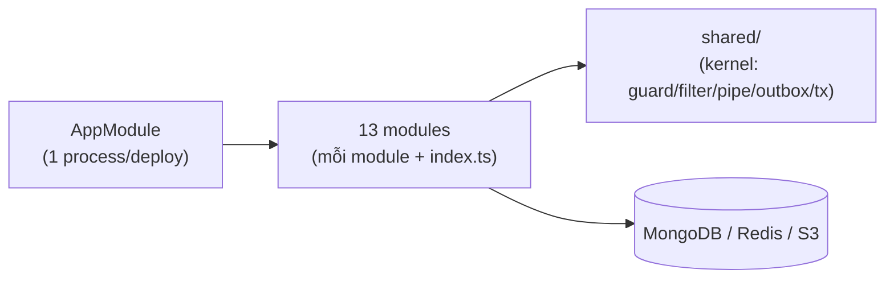
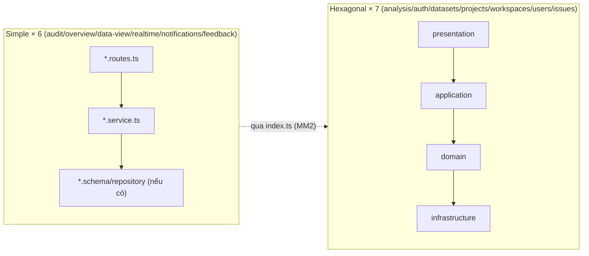

# Sơ đồ kiến trúc (hybrid 6+7)

## Vỏ Modular Monolith (cả 13 module)

```mermaid
graph LR
    APP["AppModule<br/>(1 process/deploy)"] --> M13["13 modules<br/>(mỗi module + index.ts)"]
    M13 --> SHARED["shared/<br/>(kernel: guard/filter/pipe/outbox/tx)"]
    M13 --> DB[("MongoDB / Redis / S3")]
```

## Ruột heterogeneous

```mermaid
graph LR
    subgraph S["Simple × 6 (audit/overview/data-view/realtime/notifications/feedback)"]
        R["*.routes.ts"] --> SVC["*.service.ts"]
        SVC --> SCH["*.schema/repository (nếu có)"]
    end
    subgraph H["Hexagonal × 7 (analysis/auth/datasets/projects/workspaces/users/issues)"]
        P["presentation"] --> A["application"]
        A --> D["domain"]
        D --> I["infrastructure"]
    end
    S -.->|"qua index.ts (MM2)"| H
```
